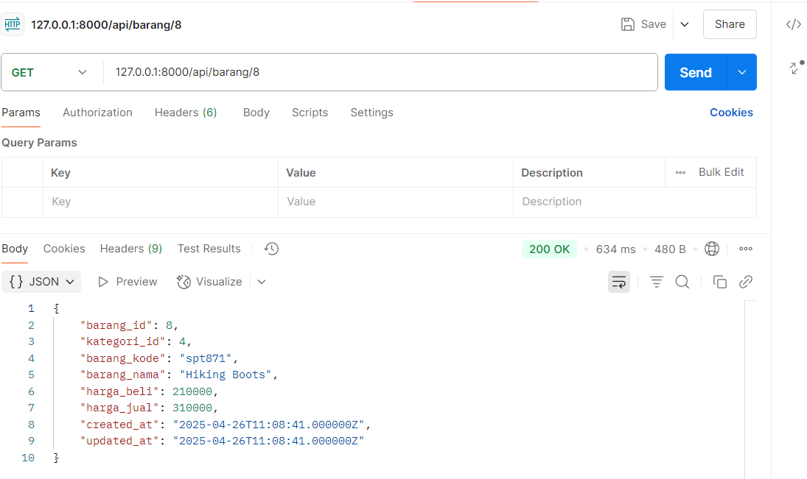

# Jobsheet- 11: Implementasi RESTful API Lanjutan dengan Eloquent Accessor di Laravel

- **Nama**: Taufik Dimas Edystara
- **NIM**: 2341720062
- **Kelas**: TI-2A

## Praktikum 1 – Eloquent Accessor

1. Menambahkan kolom `picture_path` pada tabel `m_user` melalui migration:

   ```bash
   php artisan make:migration add_photo_to_m_user
   ```

   Kemudian, modifikasi isi migration dan jalankan:

   ```bash
   php artisan migrate
   ```

2. Memodifikasi `UserModel.php` untuk menambahkan kolom `picture_path` pada `$fillable`, dan menambahkan fungsi accessor `picturePath()` untuk menghasilkan path lengkap gambar:

   ```php
   protected function picturePath(): Attribute
   {
       return Attribute::make(
           get: fn ($value) => url('/storage/users/' . $value),
       );
   }
   ```

3. Menyesuaikan validasi dan proses simpan gambar pada `RegisterController.php`:

   - Menambahkan validasi pada field `picture_path`
   - Menyimpan nama gambar ke database melalui `$request->picture_path`
   - Menampilkan JSON response jika berhasil/ gagal

4. Menguji endpoint `POST /api/register1` menggunakan Postman:
   - Isi key `picture_path` dengan tipe `File`, dan upload gambar
   - Pastikan response menampilkan path lengkap file dari accessor

📌 **File yang diubah/dibuat:**

- `database/migrations/add_photo_to_m_user.php`
- `app/Models/UserModel.php`
- `app/Http/Controllers/Api/RegisterController.php`
- `routes/api.php`

Hasil:<br>

### Berikut jawaban untuk Kalimat yang ditandai merah pada Jobsheet:

10. Uji coba dan screenshot hasilnya <br>
     > Screenshot diatas hasil setelah menggunakan hash

## Tugas – Implementasi API untuk upload file/gambar pada Tabel Lain:

### Implementasikan API untuk upload file/gambar pada tabel lainnya yaitu tabel m_barang dan gunakan pada transaksi. Uji coba dengan method GET untuk memanggil data yang sudah di inputkan.

<br>

