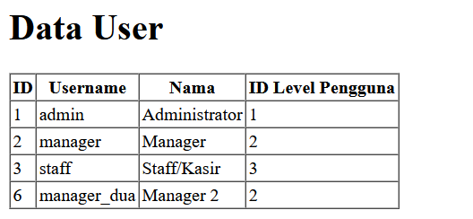
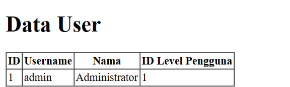
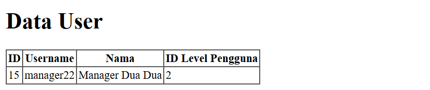
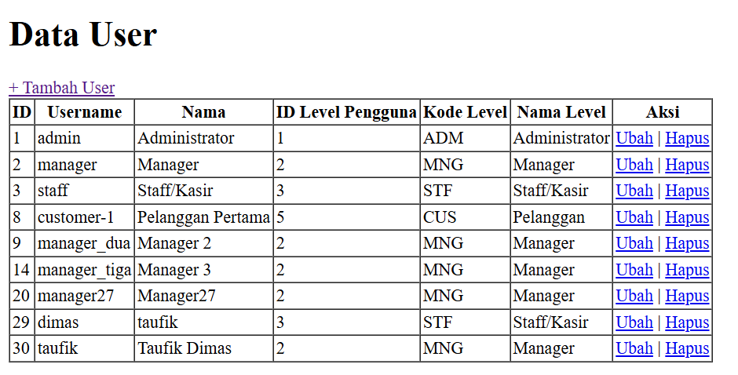

# Jobsheet 4 - MODEL dan ELOQUENT ORM

## Dokumentasi Output hasil pratikum

> **Praktikum** **1.1** **\$fillable:**
>
>  style="width:6.26805in;height:2.0875in" />
>
> - Kode tersebut akan membuat record baru dengan username : manager_dua pada table user
>
>  style="width:6.26805in;height:1.23819in" />
>
> - Akan terjadi tampilan error karena adanya konflik antara model dan controller, di mana dalam kasus ini kolom password pada model tidak didefiniskan, namun pada fungsi create terdapat array yang terdapat index

> **Praktikum** **2.1** **–** **Retrieving** **Single** **Models**
>
>  style="width:5.54861in;height:1.23819in" />
>
> - Program tersebut akan hanya mengambil data m_user untuk index ke 1
>
> 
>
> - Ketiga syntax terbsebut akan mempunyai output yang sama yaitu akan mengprint record pertama.
>
>  style="width:6.26805in;height:1.6993in" />
>
> - Program tersebut akan mencari id 1, jika idnya tidak ditemukan maka akan muncul halaman not found.
> - Akan muncul halaman error 404 karena id 21 tidak ditemukan.

> **Praktikum** **2.2** **–** **Not** **Found** **Exceptions**
>
> 
>
>  style="width:3.27764in;height:1.66458in" />
>
> - Akan muncul halaman erorr 404 karena username manager9 tidak ditemukan

> **Praktikum** **2.3** **–** **Retreiving** **Aggregrates**
>
>  style="width:5.7218in;height:0.54097in" />
>
> - Akan mempunyai output dari menghitung berapa record yang mempunyai user_level 2
>
>   style="width:6.26805in;height:2.74028in" />

> **Praktikum** **2.4** **–** **Retreiving** **or** **Creating** > **Models**
>
>  style="width:6.26805in;height:0.91389in" />
>
> - Akan terjadi error karena funsgi first tidak dapan mencari username manager dan nama Manager. Karena tidak ketemu fungsi tersebut akan menjalankan fungsi create,
>   namun karena attribute level id tidak ada value maka akan terjadi error.
>
>   style="width:6.26805in;height:0.92569in" /> >  style="width:6.26805in;height:0.73819in" />
>
> - jika menambahkan kode yang mendefiniskan user_level, maka tampilan akan menjadi serti ini

> **Praktikum** **2.5** **–** **Attribute** **Changes**
>
>  style="width:6.26805in;height:0.83889in" />
>
> - Ini berarti attributenya belum ada yang terganti.
>
>  style="width:6.26805in;height:0.83611in" />
>
> - Hasil tersebut menandakan bahwa data telah pernah diubah.

> **Praktikum** **2.6** **–** **Create,** **Read,** **Update,** **Delete** > **(CRUD)**
>
>  style="width:5.46458in;height:3.32014in" />
>
> - Akan berisikan table crud yang berisikan m_user
>
>  style="width:6.26805in;height:2.25972in" />
>
> - Akan muncul halaman untuk mengcreate data baru untuk m_user
>
>  style="width:5.37569in;height:2.24653in" />
>
> - Akan maka jika isisan disi dan tombol simpan diklik, maka akan menambahkan record baru

> **Praktikum** **2.7** **–** **Relationships**
>
>  style="width:6.26805in;height:3.43333in" />
>
> - Akan menampilkan value dari kode level dan nama level

# To Be Continued
