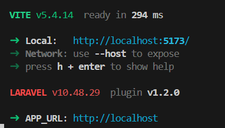
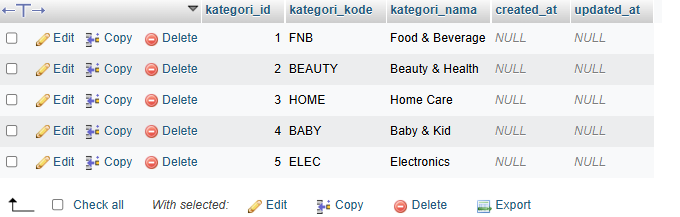
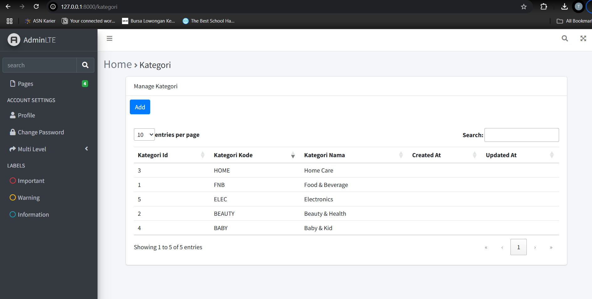

# Jobsheet-5: Blade View, Web Templating(AdminLTE), Datatables

- **Nama**: Taufik Dimas Edystara
- **NIM**: 2341720062
- **Kelas**: TI-2A

## Praktikum 1 - Integrasi Laravel dengan AdminLte3

1. **Menginstal AdminLTE**

```bash
  composer require jeroennoten/laravel-adminlte

  php artisan adminlte:install
```

2. **Konfigurasi AdminLTE**

- `resources/views/layouts/app.blade.php`:
  ```php
  @extends('adminlte::page')
  @section('title', 'Dashboard')
  @section('content')
      <h1>Selamat datang di Dashboard</h1>
  @endsection
  ```
- `resources/views/welcome.blade.php`:

  ```php
  @extends('layout.app')

  {{-- Customize layout sections --}}
  @section('subtitle', 'Welcome')
  @section('content_header_title', 'Home')
  @section('content_header_subtitle', 'Welcome')

  {{-- Content body: main page content --}}
  @section('content_body')
      <p>Welcome to this beautiful admin panel.</p>
  @stop

  {{-- Push extra CSS --}}
  @push('css')
      {{-- Add here extra stylesheets --}}
      {{-- <link rel="stylesheet" href="/css/admin_custom.css"> --}}
  @endpush

  {{-- Push extra scripts --}}
  @push('js')
      <script> console.log("Hi, I'm using the Laravel-AdminLTE package!"); </script>
  @endpush
  ```

- **Output Pratikum 1**


---

## Praktikum 2 - Integrasi dengan DataTables

1. **Menginstal Yajra DataTables**

```bash
composer require laravel/ui --dev

composer require yajra/laravel-datatables:^10.0

npm i laravel-datatables-vite --save-dev

npm install -D sass
```

- Pastikan nodejs sudah terinstall, dengan perintah npm -v.
  

2. **Langkah Praktikum**

- Edit file resources/js/app.js
  ```js
  import "./bootstrap";
  import "../sass/app.scss";
  import "laravel-datatables-vite";
  ```
- Buatlah file resources/saas/app.scss

  ```scss
  // Fonts
  @import url("https://fonts.bunny.net/css?family=Nunito");

  // Bootstrap
  @import "bootstrap/scss/bootstrap";

  // DataTables
  @import "bootstrap-icons/font/bootstrap-icons.css";
  @import "datatables.net-bs5/css/dataTables.bootstrap5.min.css";
  @import "datatables.net-buttons-bs5/css/buttons.bootstrap5.min.css";
  @import "datatables.net-select-bs5/css/select.bootstrap5.css";
  ```

- Edit KategoriDataTable.php
   <div style="max-height: 350px; overflow-y: auto;">

  ```php
  <?php

  namespace App\DataTables;

  use App\Models\KategoriModel;
  use Illuminate\Database\Eloquent\Builder as QueryBuilder;
  use Yajra\DataTables\EloquentDataTable;
  use Yajra\DataTables\Html\Builder as HtmlBuilder;
  use Yajra\DataTables\Html\Button;
  use Yajra\DataTables\Html\Column;
  use Yajra\DataTables\Html\Editor\Editor;
  use Yajra\DataTables\Html\Editor\Fields;
  use Yajra\DataTables\Services\DataTable;

  class KategoriDataTable extends DataTable
  {
     /**
     * Build the DataTable class.
     *
     * @param QueryBuilder $query Results from query() method.
     */
     public function dataTable(QueryBuilder $query): EloquentDataTable
     {
        return (new EloquentDataTable($query))
              ->addColumn('action', 'kategori.action')
              ->setRowId('id');
     }

     /**
     * Get the query source of dataTable.
     */
     public function query(KategoriModel $model): QueryBuilder
     {
        return $model->newQuery();
     }

     /**
     * Optional method if you want to use the html builder.
     */
     public function html(): HtmlBuilder
     {
        return $this->builder()
                    ->setTableId('kategori-table')
                    ->columns($this->getColumns())
                    ->minifiedAjax()
                    //->dom('Bfrtip')
                    ->orderBy(1)
                    ->selectStyleSingle()
                    ->buttons([
                          Button::make('excel'),
                          Button::make('csv'),
                          Button::make('pdf'),
                          Button::make('print'),
                          Button::make('reset'),
                          Button::make('reload')
                    ]);
     }

     /**
     * Get the dataTable columns definition.
     */
     public function getColumns(): array
     {
        return [
           Column::make('kategori_id'),
           Column::make('kategori_kode'),
           Column::make('kategori_nama'),
           Column::make('created_at'),
           Column::make('updated_at'),
        ];
     }

     /**
     * Get the filename for export.
     */
     protected function filename(): string
     {
        return 'Kategori_' . date('YmdHis');
     }
  }
  ```

- Update KategoriModel.php

  ```php
  <?php
  namespace App\Models;

  use Illuminate\Database\Eloquent\Factories\HasFactory;
  use Illuminate\Database\Eloquent\Model;
  use Illuminate\Database\Eloquent\Relations\HasMany;

  class KategoriModel extends Model
  {
     use HasFactory;

     protected $table = 'm_kategori';
     protected $primaryKey = 'kategori_id';
     protected $fillable = ['kategori_kode', 'kategori_nama'];

     public function barang(): HasMany
     {
        return $this->hasMany(BarangModel::class, 'barang_id', 'barang_id');
     }
  }
  ```

- Update KategoriController.php

  ```php
  <?php

  namespace App\Http\Controllers;

  use App\DataTables\KategoriDataTable;
  use Illuminate\Contracts\View\View;
  use Illuminate\Http\JsonResponse;

  class KategoriController extends Controller
  {
     public function index(KategoriDataTable $dataTable): View|JsonResponse
     {
        return $dataTable->render('kategori.index');
     }
  }
  ```

- Buat view blade index untuk kategori di path `resources/views/kategori/index.blade.php`

  ```php
  @extends('layouts.app')

  {{-- Customize layout sections --}}

  @section('subtitle', 'Kategori')
  @section('content_header_title', 'Home')
  @section('content_header_subtitle', 'Kategori')

  @section('content')
     <div class="container">
           <div class="card">
              <div class="card-header">Manage Kategori</div>
              <div class="card-body">
                 {{ $dataTable->table() }}
              </div>
           </div>
     </div>
  @endsection

  @push('scripts')
     {{ $dataTable->scripts() }}
  @endpush
  ```

- Memastikan route kategori sudah tersedia

  ```php
  Route::get('/kategori', [KategoriController::class, 'index']);
  ```

- Menyesuaikan app layout
  <div style="max-height: 350px; overflow-y: auto;">

  ```php
  @extends('adminlte::page')
  {{-- Extend and customize the browser title --}}
  @section('title')
     {{ config('adminlte.title') }}
     @hasSection('subtitle')
        | @yield('subtitle')
     @endif
  @stop
  {{-- Extend and customize the page content header --}}
  @section('content_header')
     @hasSection('content_header_title')
        <h1 class="text-muted">
              @yield('content_header_title')
              @hasSection('content_header_subtitle')
                 <small class="text-dark">
                    <i class="fas fa-xs fa-angle-right text-muted"></i>
                    @yield('content_header_subtitle')
                 </small>
              @endif
        </h1>
     @endif
  @stop
  {{-- Rename section content to content_body --}}
  @section('content')
     @yield('content_body')
  @stop
  {{-- Create a common footer --}}
  @section('footer')
     <div class="float-right">
        Version: {{ config('app.version', '1.0.0') }}
     </div>
     <strong>
        <a href="{{ config('app.company_url', '#') }}">
              {{ config('app.company_name', 'My company') }}
        </a>
     </strong>
  @stop
  {{-- Add common Javascript/Jquery code --}}
  @push('js')
     <script src="https://cdn.datatables.net/2.0.2/js/dataTables.js"></script>
  @endpush

  @stack('scripts')
  {{-- Add common CSS customizations --}}
  @push('css')
     <link rel="stylesheet" href="https://cdn.datatables.net/2.0.2/css/dataTables.dataTables.css" />
     <style type="text/css">
        {{-- You can add AdminLTE customizations here --}}
        /*
                          .card-header {
                          border-bottom: none;
                          }
                          .card-title {
                          font-weight: 600;
                          }
                          */
     </style>
  @endpush
  ```

- Set ViteJs / script type defaults

  ```php
  <?php

  namespace App\Providers;

  use Illuminate\Support\ServiceProvider;
  use Yajra\DataTables\Html\Builder;

  class AppServiceProvider extends ServiceProvider
  {
     /**
     * Register any application services.
     */
     public function register(): void
     {
        //
     }

     /**
     * Bootstrap any application services.
     */
     public function boot(): void
     {
        Builder::useVite();
     }
  }
  ```

15. Isikan beberapa data ke table kategori
    

16. Datatables sudah dapat di load di url `/kategori`
    

---
