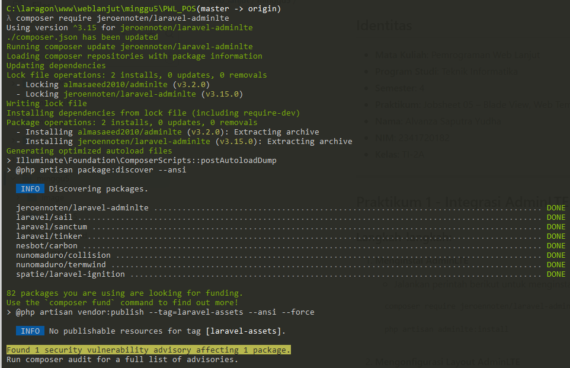
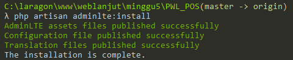
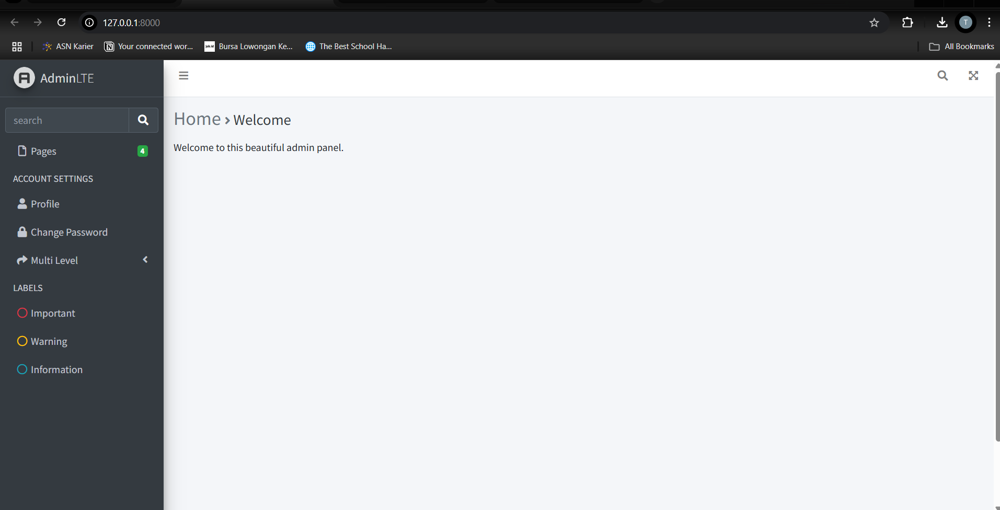

# Jobsheet-5: Blade View, Web Templating(AdminLTE), Datatables

- **Nama**: Taufik Dimas Edystara
- **NIM**: 2341720062
- **Kelas**: TI-2A

## Praktikum 1 - Integrasi Laravel dengan AdminLte3

1. **Menginstal AdminLTE**

   ```bash
   composer require jeroennoten/laravel-adminlte
   ```

   

   ```bash
   php artisan adminlte:install
   ```

   

### Output Pratikum 1



---

## Praktikum 2 - Integrasi dengan DataTables
